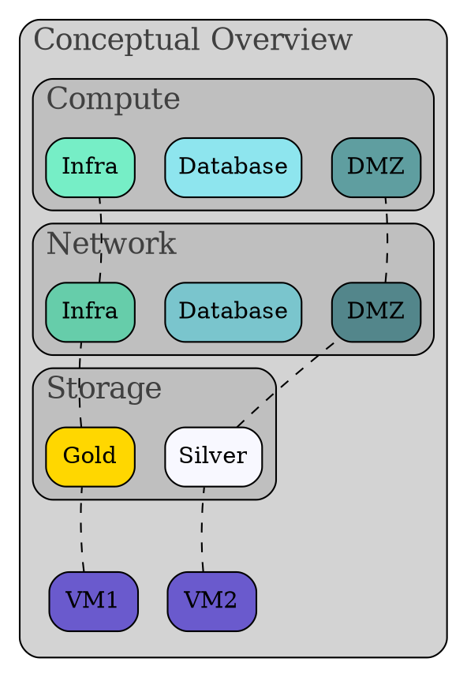

---
authors:
    - {{cookiecutter.full_name}}
date: {{cookiecutter.release_date}}
---

# Architecture Overview

This section provides an overview of the architecture. It should include a conceptual overview, and if relevant, a process / transaction flow diagram as well.

## Conceptual Overview

This should be an introduction paragraph for the diagram that follows. The components outlined in the diagram will explored in depth.

> **Note:** The diagram that follows is described in GraphViz dot format. When this document is processes by mkdocs, it will be rendered into a png.

